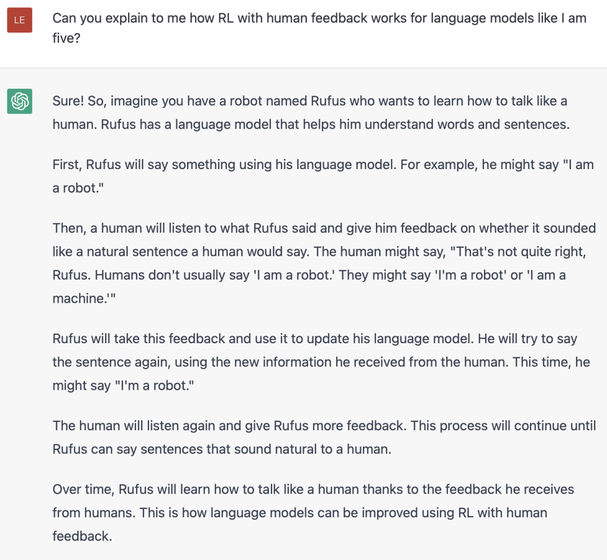
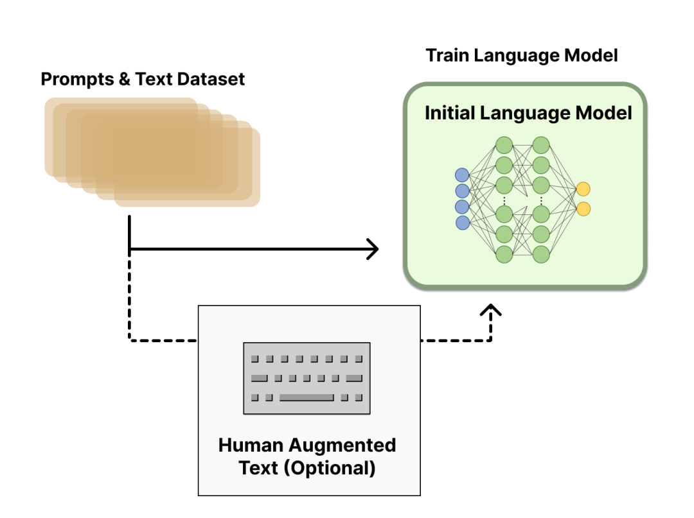
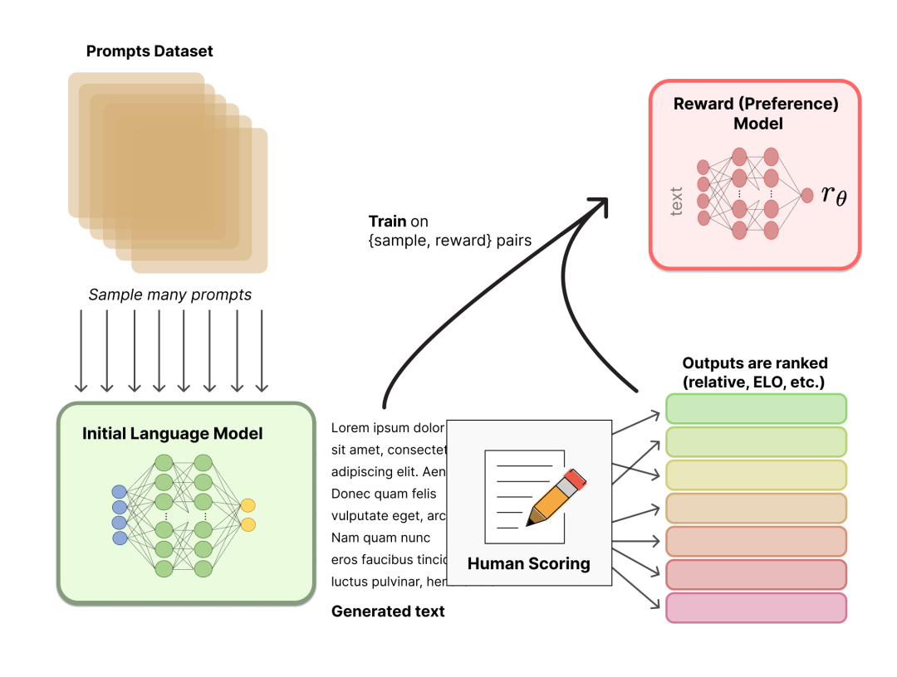

## 近端策略优化Proximal Policy Optimization

### 强化学习分类

根据一种比较通行的分类法，强化学习可以分为基于值的方法、基于策略的方法和actor-critic方法这三类。

1. **基于值函数的学习方法**: Value-Based的方法输出的是动作的价值，选择价值最高的动作。适用于非连续的动作。常见的方法有Q-learning、Deep Q Network和Sarsa
2. **基于策略梯度的学习方法**: Policy-Based的方法直接输出下一步动作的概率，根据概率来选取动作。但不一定概率最高就会选择该动作，还是会从整体进行考虑。适用于非连续和连续的动作。常见的方法有Policy gradients。一般在全连接层之后还有一个softmax层，从而将打分转化成概率。
3. **Actor-Critic:** 融合了上述两种方法，价值函数和策略函数一起进行优化。价值函数负责在环境学习并提升自己的价值判断能力，而策略函数则接受价值函数的评价，尽量采取在价值函数那可以得到高分的策略。

### PPO算法的背景

PPO是用于策略梯度(Policy Gradient， PG)下的。PG的目的是是直接建模与优化Policy

输入当前的状态，输出action的概率分布，依据概率分布选择下一个action。

### Policy gradient的具体过程和痛点

1.先有一个策略 $\theta$ ，通过这个策略收获很多数据，收集 s（state） 和 a（action）的成对资料，得到一堆游戏记录。即 $\tau^i : ( s^i, a^i)$ ，奖励是 $R^i $，

2.将资料带入公式，计算梯度: 也就是log probablility，$p_\theta(a_t|s_t)$,取梯度，乘上weight，就是当前策略的reward。

3.基于reward去更新模型，用更新后的模型获取数据，再更新模型

这里的PG算法，可以看到Agent不断和环境互动，然后学习更新，这个过程中policy是不变的。

因此，**每次更新模型后，就需要重新采样数据，造成了PG花很多时间在采样数据上。**

### PPO使用了重要性采样的思想

希望可以用一个旧策略收集到的数据来训练新策略，这意味着我们可以重复利用这些数据来更新策略多次，效率上可以提升很多。

具体来说，PPO算法利用重要性采样的思想，在不知道策略路径的概率p的情况下，通过模拟一个近似的q分布，只要p同q分布不差的太远，通过多轮迭代可以快速参数收敛

重要性采样公式：

$$
E_{x-p(x)}[f(x)] = \int p(xPf(x) dx\\
= \int \frac{q(x)}{q(x)} p(x)f(x) dx \\
= \int q(x) \frac{p(x)}{q(x)} f(x) dx \\
= E_{x-q(x)} [\frac{p(x)}{q(x)}f(x)]

$$

PPO重要的突破就是在于对新旧策略器参数进行了约束，希望新的策略网络和旧策略网络的越接近越好。

近线策略优化的意思就是：新策略网络要利用到旧策略网络采样的数据进行学习，不希望这两个策略相差特别大，否则就会学偏。

但重要性采样依然存在一个问题。**我们用q代替了p来采样x**，但是两个随机变量的分布，即使**均值mean一样**，也**不代表方差variance一样。**

PPO中，用 $\theta'$ 代替 $\theta$ 进行采样，且不希望两者差距过大，因此在里面加入一个**约束项： $\beta KL(\theta ,\theta')$**

### PPO算法

算法的步骤如下：

1. 初始化Policy的参数 $\theta ^0$.
2. 在每次迭代中，首先使用 $\theta^k$ 与环境互动，得到一堆 $ (s_t, a_t)$ 数据对，计算优势函数，我们这里可以理解成奖励。
3. 而不同于PG算法只能应用一次数据，PPO可以多次训练 $\theta$。

这里还有一个trick，即动态更新 $\beta$。我们设置一个可以接受的最大、最小KL，成为适应性KL惩罚。如果目前的KL大于设定的KL最大值，说明惩罚项没有发挥效果，就加大 $\beta$；如果比最小值小，说明惩罚项太强了，就减少 $\beta$ 。

使用KL散度的是初版的PPO算法，因为要计算KL散度还是有点复杂，因此延伸出了clip-PPO算法。

## RL from Human Feedback (RLHF)

实际上，RLHF并不是突然出现的事物，最早在2017年的NIPS就出现了这一思想。而在2020年的NIPS上，OpenAI已经尝试将其用于文本摘要任务，并取得了很好的效果。

OpenAI 推出的 ChatGPT 对话模型掀起了新的 AI 热潮，它面对多种多样的问题对答如流，似乎已经打破了机器和人的边界。这一工作的背后是大型语言模型 (Large Language Model，LLM) 生成领域的新训练范式：RLHF (Reinforcement Learning from Human Feedback) ，即以强化学习方式依据人类反馈优化语言模型。

过去几年里各种 LLM 根据人类输入提示 (prompt) 生成多样化文本的能力令人印象深刻。然而，对生成结果的评估是主观和依赖上下文的，例如，我们希望模型生成一个有创意的故事、一段真实的信息性文本，或者是可执行的代码片段，这些结果难以用现有的基于规则的文本生成指标 (如 BLUE 和 ROUGE) 来衡量。除了评估指标，现有的模型通常以预测下一个单词的方式和简单的损失函数 (如交叉熵) 来建模，没有显式地引入人的偏好和主观意见。

如果我们  **用生成文本的人工反馈作为性能衡量标准，或者更进一步用该反馈作为损失来优化模型** ，那不是更好吗？这就是 RLHF 的思想：使用强化学习的方式直接优化带有人类反馈的语言模型。RLHF 使得在一般文本数据语料库上训练的语言模型能和复杂的人类价值观对齐。

看看 ChatGPT 是如何解释 RLHF 的：

ChatGPT 解释的很好，但还没有完全讲透；让我们更具体一点吧！

### RLHF 技术分解

RLHF 是一项涉及多个模型和不同训练阶段的复杂概念，这里我们按三个步骤分解：

1. **预训练一个语言模型 (LM) ；**
2. **聚合问答数据并训练一个奖励模型 (Reward Model，RM) ；**
3. **用强化学习 (RL) 方式微调 LM。**

训练细节如下：

#### Step 1. 预训练语言模型

首先，我们使用经典的预训练目标训练一个语言模型。对这一步的模型，OpenAI 在其第一个流行的 RLHF 模型 InstructGPT 中使用了较小版本的 GPT-3; Anthropic 使用了 1000 万 ～ 520 亿参数的 Transformer 模型进行训练；DeepMind 使用了自家的 2800 亿参数模型 Gopher。

这里可以用额外的文本或者条件对这个 LM 进行微调，例如 OpenAI 对 “更可取” (preferable) 的人工生成文本进行了微调，而 Anthropic 按 “有用、诚实和无害” 的标准在上下文线索上蒸馏了原始的 LM。这里或许使用了昂贵的增强数据，但并不是 RLHF 必须的一步。由于 RLHF 还是一个尚待探索的领域，对于” 哪种模型” 适合作为 RLHF 的起点并没有明确的答案。

接下来，我们会基于 LM 来生成训练奖励模型 (RM，也叫偏好模型) 的数据，并在这一步引入人类的偏好信息。

#### Step 2. 训练奖励模型

RM 的训练是 RLHF 区别于旧范式的开端。这一模型接收一系列文本并返回一个标量奖励，数值上对应人的偏好。我们可以用端到端的方式用 LM 建模，或者用模块化的系统建模 (比如对输出进行排名，再将排名转换为奖励) 。这一奖励数值将对后续无缝接入现有的 RL 算法至关重要。

关于模型选择方面，RM 可以是另一个经过微调的 LM，也可以是根据偏好数据从头开始训练的 LM。例如 Anthropic 提出了一种特殊的预训练方式，即用偏好模型预训练 (Preference Model Pretraining，PMP) 来替换一般预训练后的微调过程。因为前者被认为对样本数据的利用率更高。但对于哪种 RM 更好尚无定论。

关于训练文本方面，RM 的提示 - 生成对文本是从预定义数据集中采样生成的，并用初始的 LM 给这些提示生成文本。Anthropic 的数据主要是通过 Amazon Mechanical Turk 上的聊天工具生成的，并在 Hub 上可用 (https://huggingface.co/datasets/Anthropic/hh-rlhf)，而 OpenAI 使用了用户提交给 GPT API 的 prompt。

关于训练奖励数值方面，这里需要人工对 LM 生成的回答进行排名。起初我们可能会认为应该直接对文本标注分数来训练 RM，但是由于标注者的价值观不同导致这些分数未经过校准并且充满噪音。通过排名可以比较多个模型的输出并构建更好的规范数据集。

对具体的排名方式，一种成功的方式是对不同 LM 在相同提示下的输出进行比较，然后使用 Elo 系统建立一个完整的排名。这些不同的排名结果将被归一化为用于训练的标量奖励值。

这个过程中一个有趣的产物是目前成功的 RLHF 系统使用了和生成模型具有 **不同** 大小的 LM (例如 OpenAI 使用了 175B 的 LM 和 6B 的 RM，Anthropic 使用的 LM 和 RM 从 10B 到 52B 大小不等，DeepMind 使用了 70B 的 Chinchilla 模型分别作为 LM 和 RM) 。一种直觉是，偏好模型和生成模型需要具有类似的能力来理解提供给它们的文本。

接下来是最后一步：利用 RM 输出的奖励，用强化学习方式微调优化 LM。

#### Step 3. 用强化学习微调

长期以来出于工程和算法原因，人们认为用强化学习训练 LM 是不可能的。而目前多个组织找到的可行方案是使用策略梯度强化学习 (Policy Gradient RL) 算法、近端策略优化 (Proximal Policy Optimization，PPO) 微调初始 LM 的部分或全部参数。因为微调整个 10B～100B+ 参数的成本过高 (相关工作参考低秩适应 LoRA 和 DeepMind 的 Sparrow LM) 。PPO 算法已经存在了相对较长的时间，有大量关于其原理的指南，因而成为 RLHF 中的有利选择。

事实证明，RLHF 的许多核心 RL 进步一直在弄清楚如何将熟悉的 RL 算法应用到更新如此大的模型。

让我们首先将微调任务表述为 RL 问题。首先，该策略 (policy) 是一个接受提示并返回一系列文本 (或文本的概率分布) 的 LM。这个策略的行动空间 (action space) 是 LM 的词表对应的所有词元 (一般在 50k 数量级) ，观察空间 (observation space) 是可能的输入词元序列，也比较大 (词汇量 ^ 输入标记的数量) 。奖励函数是偏好模型和策略转变约束 (Policy shift constraint) 的结合。

PPO 算法确定的奖励函数具体计算如下：将提示  输入初始 LM 和当前微调的 LM，分别得到了输出文本 ，将来自当前策略的文本传递给 RM 得到一个标量的奖励 。将两个模型的生成文本进行比较计算差异的惩罚项，在来自 OpenAI、Anthropic 和 DeepMind 的多篇论文中设计为输出词分布序列之间的 Kullback–Leibler (KL) 散度的缩放，即  。这一项被用于惩罚 RL 策略在每个训练批次中生成大幅偏离初始模型，以确保模型输出合理连贯的文本。如果去掉这一惩罚项可能导致模型在优化中生成乱码文本来愚弄奖励模型提供高奖励值。此外，OpenAI 在 InstructGPT 上实验了在 PPO 添加新的预训练梯度，可以预见到奖励函数的公式会随着 RLHF 研究的进展而继续进化。

最后根据 PPO 算法，我们按当前批次数据的奖励指标进行优化 (来自 PPO 算法 on-policy 的特性) 。PPO 算法是一种信赖域优化 (Trust Region Optimization，TRO) 算法，它使用梯度约束确保更新步骤不会破坏学习过程的稳定性。DeepMind 对 Gopher 使用了类似的奖励设置，但是使用 A2C (synchronous advantage actor-critic) 算法来优化梯度。

作为一个可选项，RLHF 可以通过迭代 RM 和策略共同优化。随着策略模型更新，用户可以继续将输出和早期的输出进行合并排名。Anthropic 在他们的论文中讨论了迭代在线 RLHF，其中策略的迭代包含在跨模型的 Elo 排名系统中。这样引入策略和 RM 演变的复杂动态，代表了一个复杂和开放的研究问题。

#### RLHF 的未来

尽管 RLHF 取得了一定的成果和关注，但依然存在局限。这些模型依然会毫无不确定性地输出有害或者不真实的文本。这种不完美也是 RLHF 的长期挑战和动力 —— 在人类的固有领域中运行意味着永远不会到达一个完美的标准。

收集人类偏好数据的质量和数量决定了 RLHF 系统性能的上限。RLHF 系统需要两种人类偏好数据：人工生成的文本和对模型输出的偏好标签。生成高质量回答需要雇佣兼职人员 (而不能依赖产品用户和众包) 。另一方面，训练 RM 需要的奖励标签规模大概是 50k 左右，所以并不那么昂贵 (当然远超了学术实验室的预算) 。目前相关的数据集只有一个基于通用 LM 的 RLHF 数据集 (来自 Anthropic) 和几个较小的子任务数据集 (如来自 OpenAI 的摘要数据集) 。另一个挑战来自标注者的偏见。几个人类标注者可能有不同意见，导致了训练数据存在一些潜在差异。

除开数据方面的限制，一些有待开发的设计选项可以让 RLHF 取得长足进步。例如对 RL 优化器的改进方面，PPO 是一种较旧的算法，但目前没有什么结构性原因让其他算法可以在现有 RLHF 工作中更具有优势。另外，微调 LM 策略的一大成本是策略生成的文本都需要在 RM 上进行评估，通过离线 RL 优化策略可以节约这些大模型 RM 的预测成本。最近，出现了新的 RL 算法如隐式语言 Q 学习 (Implicit Language Q-Learning，ILQL) 也适用于当前 RL 的优化。在 RL 训练过程的其他核心权衡，例如探索和开发 (exploration-exploitation) 的平衡也有待尝试和记录。探索这些方向至少能加深我们对 RLHF 的理解，更进一步提升系统的表现。
