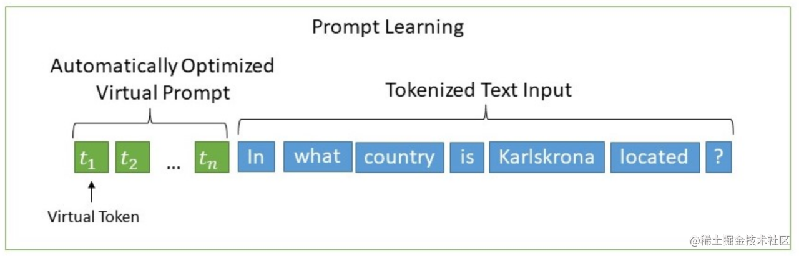
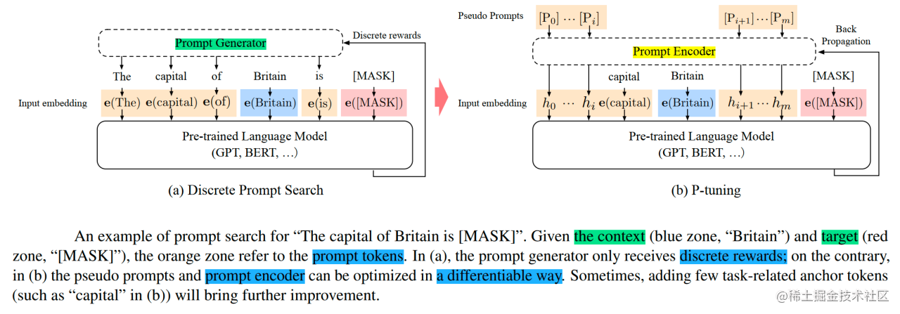
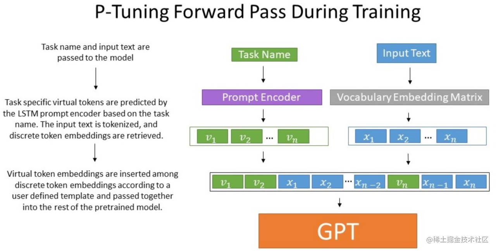
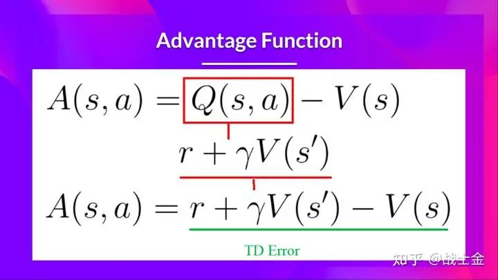

## 1.在指令微调中，如何设置、选择和优化不同的超参数，以及其对模型效果的影响？

无明确定论，总结一下分类别下的参数

* 数据集
  * drop-last
* 模型本身
* 训练设置
  * batchsize
  * clip grad
  * lr rate
  * weight decay
  * loss scale
  * warm up iters
  * lr decay style
  * lr decay iters

## 2.在指令微调中，如何选择最佳的指令策略，以及其对模型效果的影响？

总的来说，你需要先明确自己需要向什么方面微调：是一个更对齐人类价值观的gossip bot？还是更具备解决问题能力的helper？是更健谈并回答内容更丰富？还是人狠话不多？是单领域？还是多领域？

a.数据需要什么样的？

b.该如何组织数据集来微调？

首先是一些已知的要点：

Flanv2提到的一些tricks【待补充】

* 更多样的任务-使用不同的提示模板
* 混合few-shot和zero-shot learning
* 考虑输入反转
* 加入CoT
* 任务混合权重按照经验考虑即可

下面是数据集组织的方法论：

c.该如何评估sft后的model的能力？

## 3.llama, glm，bloom等现有大模型的数据处理，训练细节，以及不足之处模型架构的优化点，包括但不限于attention, norm, embedding

### LLAMA

见"03.03.各个大模型论文细节.md"

## 4.解决显存不够的方法有哪些？

### 推理

大致估算，每1B参数需要4G的显存（float32下），float16/int8/int4对应除以2就行

除参数的开销外，前向传递过程中有一小部分额外开销。一般这种开销小于等于20%。

针对参数的部分，有以下的方法：

a. 模型压缩，包括量化、蒸馏、剪枝、Moefication

b. Memory Offload，部分显存挪去内存，只是内存确实跑不动。

c. 并行

### 微调

混合精度下，20$\Phi$（见"02-06.模型参数计算.md"）

## **5.请解释P-tuning 的工作原理，并说明它与传统的fine-tuning方法的不同之处。**

一句话总结：

设计了一种连续可微的virtual token（和prefix tuning类似）

以上是prompt-tuning的方法，将前置的prompt改成virtual prompt输入模型，P-tuning则更进一步

该方法将Prompt转换为可以学习的Embedding层，并用MLP+LSTM的方式来对Prompt Embedding进行一层处理。

相比Prefix Tuning，P-Tuning加入的可微的virtual token，但仅限于输入层，没有在每一层都加；另外，virtual token的位置也不一定是前缀，插入的位置是可选的。这里的出发点实际是把传统人工设计模版中的真实token替换成可微的virtual token。

经过预训练的LM的词嵌入已经变得高度离散，如果随机初始化virtual token，容易优化到局部最优值，而这些virtual token理论是应该有相关关联的。因此，作者通过实验发现用一个prompt encoder来编码会收敛更快，效果更好。即用一个LSTM+MLP去编码这些virtual token以后，再输入到模型。

并且在实验中还发现，相同参数规模，如果进行全参数微调，Bert的在NLU任务上的效果，超过GPT很多；但是在P-Tuning下，GPT可以取得超越Bert的效果。

## **6.介绍一下Prefix-tuning的思想和应用场景，以及它如何解决一些NLP任务中的挑战**

在每一个Transformer层都带上一些virtual token作为前缀，以适应不同的任务。(prompt-tuning是prefix-tuning的简化版本，仅在输入层增加输入层引入virtual token形式的软提示（soft prompt）

特点：

* 前缀Token会占用序列长度，有一定的额外计算开销。
* Prefix Tuning的线性插值是比较复杂的。

## **7.Lora的原理和存在的问题讲一下？**

原理：

利用LLM模型参数的低秩属性（过参数化）通过先降维再升维的方法，模拟参数的改变，实现极小参数量finetune

$$
h = W_0 x + \Delta W x = W_0 x + BA x

$$

做法：

LoRA只应用于Attention模块中的4种权重矩

保证权重矩阵的种类的数量比起增加隐藏层维度r（一般4，8，16）更为重要，增加r并不一定能覆盖更加有意义的子空间。

缺点：

a.基于低秩的微调可能并不always work，比如finetune与pretrain的gap过大的时候，比如中英差异。当然，这一点在LLM时代可能并不突出，我们认为LLM在预训练阶段已经get了所有基本的知识，finetune只是格式微调，因此可能不会有上述gap过大的情况。

b.用lora也需要设置r和target module等，这部分超参的设置需要考虑

**AdaLora**

调整增量矩分配

以奇异值分解的形式对增量更新进行参数化，并根据重要性指标裁剪掉不重要的奇异值，同时保留奇异向量

$$
W = W^{(0)} + \Delta = W^{(0)} + P\Lambda Q

$$

**QLora**

4bit量化

工程上优化

## **8.bf16，fp16。半精度训练的优缺点**

### bf16和fp16

| bf16                                                                                                                                                                             | fp16                                                               |
| ---------------------------------------------------------------------------------------------------------------------------------------------------------------------------------- | -------------------------------------------------------------------- |
| Nvidia提出的16位数字表示                                                                                                                                                         | intel提出的16位数字表示，是fp32的截断                              |
| 1符号位+7指数位+8位尾数                                                                                                                                                          | 1符号位+5指数位+10位尾数                                           |
| 由于其较宽的数值范围和对精度的适当折衷， 它更适用于深度学习中的一些应用， 特别是在神经网络的训练阶段， 可以加快计算速度并减少内存使用， 同时保持足够的精度。 | 通常用于需要较高数值精度的场景， 如图形处理和一些深度学习任务 |
| 最初由Google提出， 用于Tensor Processing Units（TPU）， 现在也得到了越来越多硬件的支持， 包括一些最新的CPU和GPU。                                                 | 得到了广泛的硬件支持， 包括GPU和一些专用的深度学习加速器。    |

**FP16的优势和劣势：**

**优势** ：

1. **更高的精度** ：FP16提供了较高的精度，特别是在表示接近于零的小数时，这对于一些需要高精度计算的应用非常重要。
2. **广泛的硬件支持** ：许多现代GPU和深度学习加速器都支持FP16，这使得在这些平台上使用FP16变得容易。
3. 3.**节省内存和带宽** ：与使用全精度浮点数（如FP32）相比，FP16可以减少内存使用和数据传输量，从而提高性能和效率。

**劣势** ：

1. **有限的数值范围** ：由于指数位较少，FP16在表示非常大或非常小的数值时可能会出现溢出或下溢问题。
2. **精度损失风险** ：在一些深度学习应用中，尤其是涉及大量累积运算的情况下，使用FP16可能会导致精度损失。

**BF16的优势和劣势：**

**优势** ：

1. **更宽的数值范围** ：由于有更多的指数位，BF16能够表示更广泛的数值范围，这对于一些深度学习应用来说是非常有益的。
2. **适合深度学习** ：BF16特别适用于深度学习训练，因为它在保持足够精度的同时，能够处理更广泛的数值。
3. **硬件加速** ：随着硬件支持的增加，使用BF16可以在一些最新的CPU和GPU上实现更高效的深度学习训练。

**劣势** ：

1. **较低的精度** ：相比FP16，BF16牺牲了一些尾数位以增加指数位，这导致了精度的降低。
2. **硬件支持较新** ：虽然BF16的硬件支持正在增加，但它仍然没有FP16那么普遍，这可能限制了它在某些旧硬件上的使用。
3. **不适用于所有场景** ：对于那些需要极高精度计算的应用，比如某些类型的科学计算，BF16可能不是最佳选择。

### 半精度训练

半精度带来的优势：

1. 低显存占用，可以训练更大模型，或者使用更大batch size。
2. 减少数据通信量，节省数据传输时间（cpu和gpu，多卡之间通信）
3. 使用新架构（volta及以上）可以加速计算。

## **9.如何增加context length 模型训练中节约显存的技巧。**

### 增加Context length方法

#### 1.常规方法

结合检索和摘要

#### 2.更好的positional embedding

如Alibi、RoPE。

#### 3.优化Attention实现

如稀疏注意力sparse attention。

通过优化attention的实现，降低attention与context length的长度依赖关系。这种对attention结构的优化，会同时提升训练和推理的性能。

#### 4.Multi-Query Attention (MQA)

对于multi-head attention，每个head对应的k矩阵和v矩阵不同，所以对于每个token都有h（head数目）个k矩阵和v矩阵。

Multi-Query Attention 通过在不同head中共享K和V，即不同的head具有相同的key和value，降低了存储的k矩阵和v矩阵的数目，对于每个token存储的matrix数目由2h个，降低为两个matrix。同事也降低了计算复杂度。

#### 5.底层算子的优化

如，Flash attention

#### 6.小模型

会降低模型性能

### 节约显存的方法

1. 降低批处理的大小
2. 使用混合精度训练
3. 使用梯度累加（时间换空间）
4. 数据类型转换（可能带来精度损失）
5. 修改模型结构
6. 底层的优化（GPU内存管理策略等，如Nvidia的tensorRT和pytorch的JIT）

## **10.RLHF完整训练过程是什么？RL过程中涉及到几个模型？显存占用关系和SFT有什么区别？**

### RLHF的过程

step1. 预训练语言模型（可sft）

step2. 训练奖励模型（critic和reward模型，pair wise loss）

step3. 强化学习微调

### RL过程中的涉及到的模型数量

奖励模型阶段：

2个模型：critic和reward模型。也可以说是一个模型，毕竟两者是副本的关系

强化学习微调阶段：

4个模型：

actor_model: LLM,会进行梯度更新。

ref_model: LLM的副本，输出结果和actor_model计算KL散度，不让结果跑太远。

reward_model: 奖励函数

critic_model: 更新参数，就是advantage function中的V

通过四个模型，更新参数的模型只有actor model和critic model。

### RLHF显存占用关系和SFT的区别

显存多了很多，需要多放下副本模型ref_model,奖励模型reward_model的本体，以及critic_model的本体、梯度、优化器

## **11.RLHF过程中RM随着训练过程得分越来越高，效果就一定好吗？有没有极端情况？**

答案为否，

RL容易崩。LLM训着训着就不听你话了，要么变成停不下来的复读机，输出到后面没有逻辑直到maxlen，要么变成哑巴，直接一个eosid躺平。

RLHF中的问题其实在RL游戏训练里面很常见了，如果环境和参数设置不好的话，agent很容走极端，在 一头撞死or循环鬼畜之间反复横跳。

原始的ppo就是很难训，对SFT基模型和RM的训练数据以及采样prompt的数据要求很高，参数设置要求也很高。

## **12.encoder only，decoder only，encoder-decoder 划分的具体标准是什么？典型代表模型有哪些？**

encoder和decoder的区别在于attention mask的构造。

encoder only：BERT

decoder only：GPT

encoder-decoder： T5
